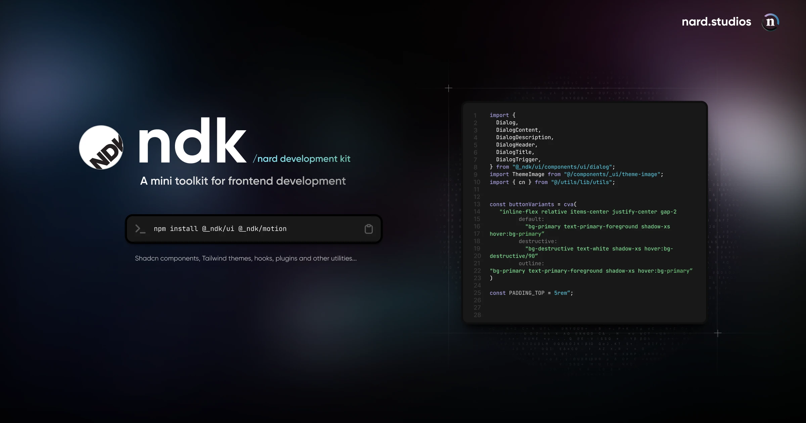

# ndk: nard development kit

A mini development toolkit for frontend development.



This project is in still in early development and APIs may change along the line. The roadmap here is to build a
bunch of packages and apps aimed at boosting development times along with "configurators" and some visual builders
similar to the approach of "no-code" tools.

## Setup

> Good to have: A global `turborepo` installation may be needed.

```bash
npm i # install dependencies

turbo dev # runs all apps and packages, or turbo --filter=web to launch only the web app's dev server
turbo build # builds all apps and packages
```

### @\_ndk/ui package (v0.1.0)

```bash
cd ./packages/ui
turbo build # builds the ui package only
```

See the [ui package](./packages/ui/README.md) docs, and also that of the [motion package](./packages/motion/README.md).

## Credits

 This project was heavily inspired by:

- [Shadcn/ui](https://ui.shadcn.com/)
- [Animate UI](https://animate-ui.com/)
